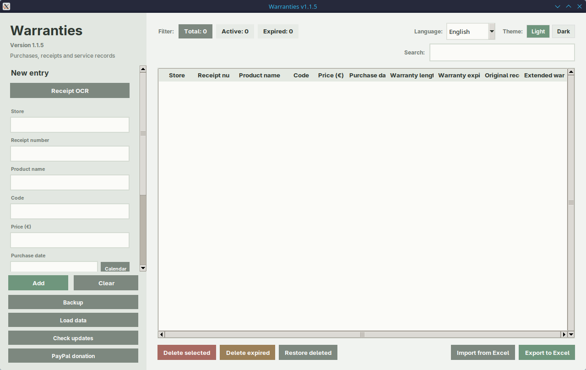

# Warranties

Desktop app for tracking purchased products, warranty periods, receipts,
extended warranties, and service records.

The app uses English as the default language. Croatian is available from the
language selector in the top-right corner. The same area also contains the
Light/Dark theme switch, and both settings are saved for the next launch.

## Screenshot

### Main window



## Repository Contents

- `garancije.py` - main application
- `requirements.txt` - required Python packages
- `Pokreni_Garancije.sh` - Linux launcher
- `Pokreni_Garancije.bat` - Windows launcher
- `Pokreni_Garancije.desktop` - Linux desktop launcher
- `.gitignore` - prevents local data, receipts, backups, and settings from
  being committed

Local user data is not part of the repository. When the app is started from
source, it uses or creates these files next to `garancije.py`. Packaged builds
use a writable folder next to the executable when possible, or
`Documents/Garancije` if the install folder is not writable:

- `garancije.db` - active local SQLite database
- `moje_garancije.csv` - legacy/import-export CSV copy
- `Garancije.xlsx` - Excel file used for import/export
- `dokumenti_garancija/` - saved receipts and warranty documents
- `backup/` - automatic SQLite and CSV backups
- `servisi_log.json` - legacy/import-export service history copy
- `postavke.json` - local language and theme settings

## Running

Python 3 and Tkinter are required.

Linux:

```bash
chmod +x Pokreni_Garancije.sh
./Pokreni_Garancije.sh
```

For double-click launching on Linux, use `Pokreni_Garancije.desktop`. If your
file manager asks for confirmation, choose **Allow Launching** or
**Trust and Launch**.

Windows:

```bat
Pokreni_Garancije.bat
```

The launchers use the installed system Python. If packages from
`requirements.txt` are missing, they install them for the current user with
`pip install --user`, without creating a virtual environment.

Manual start:

```bash
python3 -m pip install -r requirements.txt
python3 garancije.py
```

On Linux distributions, Tkinter is usually installed through a system package
such as `python-tk` or `python3-tk`, depending on the distribution.

## Interface

Available options:

- English language by default
- Croatian language as an option
- Light theme
- Dark theme

The language and theme are saved in `postavke.json`, which is created
automatically after changing settings.

## Receipt OCR Optional

To read text from receipt images, you need:

- Tesseract OCR and Croatian language data
- Python packages `Pillow` and `pytesseract`

The Python packages are included in `requirements.txt`, but Tesseract itself
must be installed through the operating system package manager.

## Data And Backups

On each launch, the app copies the existing `garancije.db` SQLite database into
the `backup/` folder and also writes a CSV snapshot. The **Backup** button
creates an additional backup of the SQLite database, CSV snapshot, service JSON
snapshot, and attached documents in a folder selected by the user. Excel export
also copies `dokumenti_garancija/` next to the exported `.xlsx` file, so
importing that file later can restore the attached documents.

If an older `moje_garancije.csv` or `servisi_log.json` file already exists, it
is migrated automatically into `garancije.db` on first launch.

Before manually replacing the database or document folder, close the app and
back up the whole local data folder.

## Notes

- Only the product name is required.
- Prices are automatically formatted with two decimals.
- Dates can be selected from the calendar or entered as `DD.MM.YYYY`.
- Warranty duration is entered as a whole number of years.
- The main database is SQLite. Excel/CSV import and export use `pandas` and
  `openpyxl`.
- Deleted records can be restored only during the current app session.

---

# Garancije

Desktop program za evidenciju kupljenih proizvoda, trajanja garancije, računa,
produljenih jamstava i servisnih zapisa.

Program koristi engleski kao zadani jezik. Hrvatski se može odabrati u gornjem
desnom dijelu prozora. Na istom mjestu nalazi se i izbor Light/Dark teme, a obje
postavke spremaju se za sljedeće pokretanje.

## Sadržaj Repozitorija

- `garancije.py` - glavni program
- `requirements.txt` - potrebni Python paketi
- `Pokreni_Garancije.sh` - Linux pokretač
- `Pokreni_Garancije.bat` - Windows pokretač
- `Pokreni_Garancije.desktop` - Linux desktop pokretač
- `.gitignore` - sprječava slanje lokalnih podataka, računa, sigurnosnih kopija
  i postavki u Git

Lokalni korisnički podaci nisu dio repozitorija. Kad se program pokreće iz
izvornog koda, koristi ih ili stvara uz `garancije.py`. Gotovi paketi koriste
upisivu mapu uz izvršnu datoteku kad je to moguće, ili `Documents/Garancije` ako
instalacijska mapa nije upisiva:

- `garancije.db` - aktivna lokalna SQLite baza podataka
- `moje_garancije.csv` - stara/import-export CSV kopija
- `Garancije.xlsx` - Excel datoteka za uvoz/izvoz
- `dokumenti_garancija/` - spremljeni računi i dokumenti jamstva
- `backup/` - automatske sigurnosne kopije SQLite baze i CSV snapshota
- `servisi_log.json` - stara/import-export kopija servisnih zapisa
- `postavke.json` - lokalni odabir jezika i teme

## Pokretanje

Potrebni su Python 3 i Tkinter.

Linux:

```bash
chmod +x Pokreni_Garancije.sh
./Pokreni_Garancije.sh
```

Za dvoklik na Linuxu pokrenite `Pokreni_Garancije.desktop`. Ako file manager
traži potvrdu, odaberite **Allow Launching** ili **Trust and Launch**.

Windows:

```bat
Pokreni_Garancije.bat
```

Skripte koriste instalirani Python. Ako nedostaju paketi iz `requirements.txt`,
instaliraju ih za trenutačnog korisnika preko `pip install --user`, bez `.venv`
okruženja.

Ručno pokretanje:

```bash
python3 -m pip install -r requirements.txt
python3 garancije.py
```

Na distribucijama Linuxa Tkinter se obično instalira paketom `python-tk` ili
`python3-tk`, ovisno o distribuciji.

## Sučelje

U programu su dostupni:

- engleski jezik kao zadani
- hrvatski jezik kao izbor
- Light tema
- Dark tema

Odabir jezika i teme sprema se u `postavke.json`, koja se automatski stvara
nakon promjene postavki.

## OCR Računa Neobavezno

Za čitanje teksta sa slike računa potrebni su:

- Tesseract OCR i hrvatski jezični podaci
- Python paketi `Pillow` i `pytesseract`

Ti Python paketi uključeni su u `requirements.txt`, ali Tesseract treba
instalirati kroz upravitelj paketa operacijskog sustava.

## Podaci I Sigurnosne Kopije

Pri svakom pokretanju program kopira postojeću SQLite bazu `garancije.db` u
mapu `backup/` i uz nju zapisuje CSV snapshot. Gumb **Backup** izrađuje dodatnu
kopiju SQLite baze, CSV snapshota, JSON snapshota servisnih zapisa i priloženih
dokumenata u mapu koju korisnik odabere. Excel izvoz također kopira
`dokumenti_garancija/` uz izvezenu `.xlsx` datoteku, kako bi kasniji uvoz mogao
vratiti priložene račune i jamstva.

Ako već postoji stari `moje_garancije.csv` ili `servisi_log.json`, program ih
pri prvom pokretanju automatski prebacuje u `garancije.db`.

Prije ručne zamjene baze ili mape s dokumentima preporučuje se zatvoriti
program i napraviti sigurnosnu kopiju cijele lokalne mape s podacima.

## Napomene

- Obavezan je samo naziv proizvoda.
- Cijene se automatski formatiraju na dvije decimale.
- Datumi se mogu odabrati iz kalendara ili unijeti u obliku `DD.MM.GGGG`.
- Trajanje garancije unosi se kao cijeli broj godina.
- Glavna baza je SQLite. Excel/CSV uvoz i izvoz koriste pakete `pandas` i
  `openpyxl`.
- Brisanje je moguće poništiti samo tijekom trenutačnog pokretanja programa.
